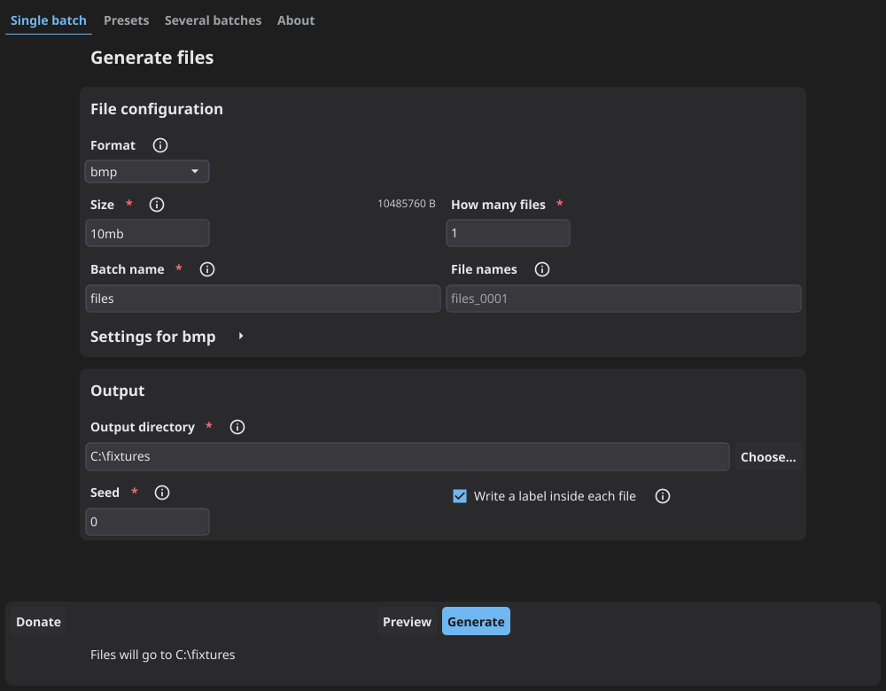

# Testing Files Generator

**Generate test files for QA, and know how the system under test should react to them.**. A free, open source tool that creates **real test files** - PDF, PNG, JPG, ZIP, DOCX, XLSX and fourteen more - at **any exact size you ask for**. It also writes down what your application should do with each one. Command line and desktop app, fully offline, on Windows, macOS and Linux.

[](https://github.com/donislawdev/TestingFilesGenerator/releases/latest)
[](https://github.com/donislawdev/TestingFilesGenerator/actions/workflows/ci.yml)
[](LICENSE)
[](https://go.dev)

[](https://github.com/donislawdev/TestingFilesGenerator/releases/latest)
[](https://github.com/donislawdev/TestingFilesGenerator/releases/latest)
[](https://github.com/donislawdev/TestingFilesGenerator/releases/latest)


⭐ **If it saved you time, leave a star.** That is how the next tester who needs it finds out it
exists.



This README is also the manual. The short version is above the line, the full
reference is below it.

## 📁 Formats it generates

Twenty, and every one is a **real file of that format** - it opens in the
software that owns it, at the exact size you asked for:

| group | formats |
|---|---|
| 📄 **Documents** | `pdf`, `docx` (Word), `xlsx` (Excel), `pptx` (PowerPoint) |
| 🖼️ **Images** | `png`, `jpg`, `bmp`, `gif`, `ico`, `svg` |
| 📝 **Text and markup** | `txt`, `md`, `csv`, `json`, `xml`, `html`, `log` |
| 🗜️ **Archives** | `zip`, `targz` (`.tar.gz`) |
| 🔊 **Audio** | `wav` |

Coming next: `7z`, `tiff`, `webp`, `mp3`, `mp4`.

Most of them take settings of their own - image dimensions, JPEG quality, PDF
page count, rows and columns in a spreadsheet, what goes inside an archive. See
[format settings](#per-format-settings).

## 🤔 The problem it solves

You are testing software that accepts files from people. Sooner or later you
need:

- a PDF of **exactly** 10 MB, to find out whether the upload limit is real
- the three files that sit either side of that limit, to catch off by one errors
- 10,000 log files, to see what the nightly job does when the folder is big
- a ZIP that genuinely holds 200 documents, not a stub with the right extension
- a 4 GB file, without keeping a 4 GB file in your repository
- the **same** fixtures on your laptop and on the build server, byte for byte

Making one such file by hand is easy. Making them repeatedly, at exact sizes, in
formats that really open in real software, is the tedious part - and that is the
part this replaces.

**Who it is for:** QA engineers, test automation, and anyone whose code has an
upload form, an import routine, a parser or a storage quota behind it.

## ⭐ What makes it different

Other generators stop at the bytes. They hand you a folder, and you are still
the one deciding what each file is supposed to prove.

This one answers the question your test actually asks: **what should happen when
this file arrives?**

Every run writes a `manifest.json` beside the files - a plain list of everything
it produced, and for each entry a declared expectation. Say your upload endpoint
allows 1 MB. Ask for the three files that sit on that line:

```
tfg generate --preset size-boundaries --limit 1mb --spread 1B --format pdf --out ./edges
```

| file | bytes | your system should | because |
|---|---|---|---|
| `1mb_under_1b.pdf` | 1048575 | **accept** it | it is inside the limit |
| `1mb_at_limit.pdf` | 1048576 | **accept** it | the limit itself is allowed |
| `1mb_over_1b.pdf` | 1048577 | **reject** it | `size_limit` |

Three files, three different answers, in machine readable form. Your test reads
the manifest instead of you hand writing the assertions:

```python
import json
import os

directory = "edges"
manifest = json.load(open(os.path.join(directory, "manifest.json")))

for entry in manifest["files"]:
    response = upload(os.path.join(directory, entry["path"]))
    outcome = entry["expected"]["outcome"]
    if outcome == "accept":
        assert response.ok, entry["path"]
    elif outcome == "reject":
        assert not response.ok, entry["path"]
```

And where the right answer genuinely depends on your own policy, the manifest
says `unspecified` instead of inventing one. A generator that guesses produces
false failures, and a suite that cries wolf gets switched off.

## ✨ Features

| | |
|---|---|
| 🎯 **Exact size, to the byte** | Ask for 10485761 bytes and get exactly that. Never a silently rounded file. |
| 📄 **20 real formats** | Not padded zeros with an extension. A generated PNG opens in an image viewer, a DOCX opens in Word, a ZIP extracts. |
| 🧾 **A manifest that is a test oracle** | Path, size, SHA-256, format, seed, tool version - and what your system should do with the file. |
| 🔁 **Reproducible** | Same recipe and seed, same bytes, on any machine. Commit a small recipe instead of large binary fixtures. |
| 🖥️ **Two interfaces, one engine** | A command line built for CI, and a desktop window for exploratory testing. Neither is a cut down version of the other. |
| 🔌 **Completely offline** | No account, no cloud, no telemetry, no update checks. The command line binary has no network stack compiled into it at all. |
| 🧹 **Cleans up after itself** | `verify` tells you nothing moved, `cleanup` removes exactly what was written and nothing else. |
| 🆓 **Free and open source** | GPL-3.0. The files you generate are yours, with no strings attached. |

## 📦 Install

**Download a binary.** Take the archive for your system from the
[releases page](https://github.com/donislawdev/TestingFilesGenerator/releases),
unpack it and run it. `tfg` is the command line, `tfg-gui` is the desktop
window. The Windows and macOS downloads are signed, so they start without a
warning about an unknown developer. The Linux ones are not, because desktop
Linux has no equivalent to sign them with.

**With Go installed:**

```
go install github.com/donislawdev/TestingFilesGenerator/cmd/tfg@latest
```

**From source.** Needs Go 1.26.5 or newer, and nothing else:

```
git clone https://github.com/donislawdev/TestingFilesGenerator
cd TestingFilesGenerator
go build ./cmd/tfg
```

The desktop window is a second binary, `go build ./cmd/tfg-gui`. It draws
through OpenGL and reaches it through C, so that one needs a C compiler and is
built natively on each system. Built without one it still compiles, and says on
start that it has no window in it and that everything is on the command line.

## 🚀 Quick start

**1. Make a file.** One PNG, exactly two megabytes:

```
tfg generate --format png --size 2mb --out ./out
```

**2. Make a lot of files.** Ten thousand log files, each between one and eight
kilobytes, with the sizes drawn from the seed so tomorrow gives the same set.
**Give each run its own directory** - the manifest is the only record of what a
run wrote, so the tool refuses to write a second one over it:

```
tfg generate --format log --size-range 1kb-8kb --count 10000 --out ./logs
```

**3. Check them, then remove them.**

```
tfg verify ./logs/manifest.json
tfg cleanup ./logs/manifest.json --yes
```

```
logs matches ./logs/manifest.json: 10000 files checked
```

**Sizes count in 1024s**, the way your file manager does, so `2mb` means
2097152 bytes. A plain byte count works too: `--size 2097152`.

---

# Reference

Everything the tool does, in one place.

## 🎛️ Commands

```
tfg generate    produce files, from a recipe or from flags
tfg validate    check a recipe and write nothing
tfg verify      check a directory against a manifest
tfg cleanup     remove the files a manifest lists
tfg recipe fmt  print a recipe in its settled shape
tfg preset      build a set of files from a named test question
tfg formats     list the formats this build supports
tfg version     print the tool version
tfg license     print the licence and what it means for generated files
```

### `tfg generate`

```
tfg generate <recipe.yaml> [flags]      settings come from the file
tfg generate --format txt --size 1mb    settings come from the flags
```

| flag | what it does |
|---|---|
| `--format <id>` | format of the files, for example `txt` |
| `--size <size>` | exact size of every file, such as `10mb` or a plain byte count |
| `--size-range <a-b>` | a size drawn per file from a range, such as `1kb-8kb`. The draw comes from the seed |
| `--boundary <size>` | three files around a limit: one byte under, the limit, one byte over |
| `--count <n>` | how many files to produce. Default `1` |
| `--id <name>` | target id, the anchor the seeds are derived from. Default `files` |
| `--name <template>` | name template, for example `invoice_{index:04}.txt` |
| `--out <dir>` | directory to write into. Default `.` |
| `--seed <n>` | run seed. The same seed gives the same bytes |
| `--set <k>=<v>` | a format setting, repeatable: `--set width=1920 --set height=1080` |
| `--expected <outcome>` | `accept`, `reject`, `sanitize` or `unspecified` |
| `--expected-reason <r>` | why that outcome, from the closed list below |
| `--preset <id>` | build the set a named test question calls for |
| `--clean` | turn off the self describing label written inside each file |
| `--dry-run` | count and show, write nothing at all |
| `--json` | write the manifest to standard output |

### `tfg validate`

```
tfg validate <recipe.yaml> [--json]
```

Checks a recipe and writes nothing. Reports **every** problem at once rather
than the first, and each one names the setting it is about. Prints a hash of the
recipe in its settled shape - the same hash that goes into the manifest.

### `tfg verify`

```
tfg verify <manifest.json> [--against <dir>] [--json]
```

Reports files that are missing, files nobody asked for, and files whose content
has changed. `--against` picks a different directory - by default it checks the
one holding the manifest.

### `tfg cleanup`

```
tfg cleanup <manifest.json> [--yes] [--force] [--with-manifest] [--against <dir>] [--json]
```

Removes what the manifest lists and **nothing else**. Without `--yes` it deletes
nothing and prints what it would remove. A file whose content changed since it
was written is left alone and reported, because it may not be ours - `--force`
removes those too. `--with-manifest` removes the manifest as well, once every
file it lists is gone.

### `tfg recipe fmt`

```
tfg recipe fmt <recipe.yaml> [-w] [--check]
```

Prints a recipe in its settled shape, comments kept. `-w` writes it back to the
file, `--check` prints nothing and ends with code `3` when the layout is not
settled - useful in a pre-commit hook. It says nothing about whether the recipe
is **valid**, which is what `tfg validate` is for.

### `tfg preset`

```
tfg preset list [--json]              what this build offers
tfg preset show <id> [--json]         what it takes and what it would produce
tfg preset eject <id> > my.yaml       the recipe it stands for, to edit
```

### `tfg formats`

```
tfg formats [--json]     every format, with fidelity, determinism and smallest size
tfg formats <id>         what a single format accepts
```

## 📜 Recipes

A recipe is a YAML file describing a whole run. Commit it beside your tests and
the fixtures stop being binaries in your repository:

```yaml
# fixtures.yaml
version: 1
seed: 7741

defaults:
  label: true

targets:
  - id: invoices
    format: pdf
    count: 25
    size: 300kb
    name: invoice_{index:04}.pdf
    properties:
      pages: 3
      page_size: a4
    expected: accept

  - id: over_the_limit
    format: png
    count: 2
    size: 12mb
    expected:
      outcome: reject
      reason: size_limit

  - id: bundle
    format: zip
    contains:
      - format: txt
        count: 200
        size: 4kb

output:
  dir: ./fixtures
  manifest: manifest.json
```

```
tfg validate fixtures.yaml
tfg generate fixtures.yaml
```

### Top level keys

| key | meaning |
|---|---|
| `version` | recipe schema version. `1` |
| `seed` | the number that makes a run repeatable. Same seed, same bytes |
| `defaults.label` | write the self describing label inside each file. Default `true` |
| `targets` | the list of things to produce. See below |
| `output.dir` | where the files and the manifest go |
| `output.manifest` | manifest file name. Default `manifest.json` |

### Target keys

| key | meaning |
|---|---|
| `id` | names the target, and is the anchor its seeds are derived from |
| `format` | one of the formats below |
| `count` | how many files. Default `1` |
| `size` | exact size of every file |
| `size-range` | a size drawn per file from a range, such as `1kb-8kb` |
| `boundary` | three files around a limit: under, at, over |
| `contains` | for archives: entries of `format`, `count` and `size` |
| `name` | name template, such as `invoice_{index:04}.pdf` |
| `label` | override `defaults.label` for this target |
| `group` | a label carried into the manifest, for grouping in reports |
| `properties` | the format's own settings. See the table below |
| `expected` | what your system should do with these files |

**Every target needs exactly one of `size`, `size-range`, `boundary` or
`contains`.** Two of them is an error, and so is none.

### Declaring expectations

Short form, when the outcome is enough:

```yaml
expected: accept
```

Long form, when the reason matters:

```yaml
expected:
  outcome: reject
  reason: size_limit
```

**Outcomes:** `accept`, `reject`, `sanitize`, `unspecified`.

**Reasons** are a closed list, so a report can group by them:

`content_malformed`, `count_limit`, `dimensions_limit`, `duplicate`,
`encoding_invalid`, `extension_rule`, `filename_invalid`, `filename_too_long`,
`filename_traversal`, `malware_signature`, `mime_mismatch`, `nesting_depth`,
`none`, `size_limit`, `size_zero`.

A reason names **the rule in play**, not the verdict. That is why the same
reason can sit under either outcome - a file one byte under a limit is
`accept`, and the rule it is about is still `size_limit`.

### Not built yet

These keys are recognised and **refused with a message saying so**, never
ignored quietly: `extends`, `with`, `policy`, `engine`, `defaults.fill`,
`fill` on a target, `mutations`, `output.split_threshold`.

## 📁 Formats in detail

The twenty formats are listed near the top of this file. Each is produced at an
exact size and checked against independent readers before it ships - a PNG is
opened and its pixels compared, a DOCX is read back by three separate
libraries, an archive is extracted.

```
tfg formats           # every format, with fidelity, determinism and smallest size
tfg formats png       # what a single format accepts
```

### Per format settings

Set them with `--set key=value` on the command line, or under `properties:` in a
recipe. `tfg formats <id>` prints the allowed range or list for each:

| format | settings |
|---|---|
| `pdf` | `pages`, `page_size` |
| `png`, `bmp`, `gif` | `width`, `height` |
| `jpg` | `width`, `height`, `quality` |
| `ico` | `width`, `height`, `embed` |
| `wav` | `sample_rate`, `bit_depth`, `channels`, `content` |
| `zip`, `targz` | `entries`, `entry_format`, `entry_size` |
| `docx` | `paragraphs` |
| `xlsx` | `rows`, `columns` |
| `pptx` | `slides` |
| `csv`, `json`, `xml`, `html`, `md`, `log`, `txt`, `svg` | none |

```
tfg generate --format jpg --size 500kb --set width=1920 --set height=1080 --set quality=85
```

**Ask for a size a format cannot reach and you get an error, never a file of the
wrong size.** The message names the format, the smallest it can be, the reason
for that floor and what to do instead. `tfg formats` lists every floor.

## 🧾 The manifest

Written next to the files at the end of every run, including a run that was
interrupted. One entry per file:

```json
{
  "manifest_version": "1.0",
  "tool": { "name": "testing-files-generator", "version": "0.1.0" },
  "run": {
    "id": "run_b359aa8d94",
    "seed": 0,
    "command": "tfg generate --format png --size 2mb --out ./out",
    "platform": { "os": "windows", "arch": "amd64" },
    "complete": true
  },
  "summary": {
    "file_count": 1,
    "total_bytes": 2097152,
    "by_format": { "png": 1 },
    "by_expected": { "unspecified": 1 }
  },
  "files": [
    {
      "path": "files_0001.png",
      "bytes": 2097152,
      "format": "png",
      "fidelity": "full",
      "determinism": "byte",
      "seed": "8dc2d18c",
      "hashes": { "sha256": "1a1f7c..." },
      "properties": { "width": 640, "height": 480 },
      "expected": {
        "outcome": "unspecified",
        "detail": "No expectation was declared for this file.",
        "confidence": "policy_dependent"
      }
    }
  ]
}
```

`recipe_hash` is added when the run came from a recipe, and `preset` and
`overrides` when it came from a preset - so a manifest can always be traced back
to what produced it.

Every entry also carries `target_id`, the id of the target in the recipe that
produced the file, and `summary.by_target` counts the files each target came to.
A recipe with several targets can therefore be checked target by target without
reading file names.

## 🧪 Presets

A preset is a ready made set of files that answers a common testing question, so
you do not have to design the set yourself:

```
tfg preset list
tfg preset show size-boundaries
tfg generate --preset size-boundaries --limit 10mb --out ./limits
```

`show` tells you what the set would cost before you build it, and says outright
when a number is a placeholder of ours rather than a limit of yours. Presets are
ordinary recipes underneath - `tfg preset eject size-boundaries` prints the
recipe and you edit it from there.

One preset ships today, `size-boundaries`. More are designed.

## 🖥️ The desktop window

The same engine with a window on it, for the testing that is not scripted. It is
not a cut down version: a test compares the two interfaces capability by
capability, and anything only one of them can do has to be declared and
justified rather than quietly drifting apart.

Four screens - one batch, presets, several batches at once, and about. It shows
what a run would cost before writing anything, reports progress while it runs,
and can be cancelled part way without leaving a half written file behind.

It does not open a recipe file yet. Recipes are a command line thing for now,
and the window builds its batches in the form.

## ⚙️ Using it in CI

Built for it. Every ending has its own exit code, machine readable output goes
to standard output, and a failed run prints nothing there:

| code | meaning |
|---|---|
| `0` | everything worked |
| `1` | an unexpected error inside the tool |
| `2` | wrong command or flag |
| `3` | the recipe is not valid |
| `4` | the format cannot do what was asked |
| `5` | a read or write failed |
| `6` | not enough disk space |
| `7` | `verify` found a mismatch |
| `8` | the run finished but not everything was produced |
| `130` / `143` | interrupted by Ctrl+C, or stopped by a signal |

```yaml
- name: build the fixtures
  run: tfg generate fixtures.yaml --out ./fixtures

- name: run the tests
  run: pytest tests/

- name: nothing moved
  run: tfg verify ./fixtures/manifest.json
```

An invalid recipe writes **no files at all** and reports every problem at once,
each naming the setting it is about. A run stopped with Ctrl+C still leaves a
manifest, and never leaves a half written file behind.

## ❓ Questions

### How is this different from `dd`, `fsutil` or `truncate`?

Those give you a file of the right size full of nothing. A 2 MB file named
`photo.png` made that way is not a PNG, so anything that really parses it
rejects it for the wrong reason - and your test then passes for the wrong reason
too. Here it is a real PNG of exactly 2 MB that opens in an image viewer, and it
arrives with a statement about how your system should treat it.

### Is it free? Can I use it at work?

Yes to both. It is GPL-3.0 and costs nothing.

### Can I use the generated files in a closed source product?

Yes. The licence covers the code of the tool, not what the tool produces.
Generated files, recipes and manifests are output, not derived works, so you can
commit them and ship them with no obligation.

### Do the files contain real personal data?

No. Everything inside is synthesised from a seed. No dataset is read, no service
is contacted, no third party content is embedded.

### Will I get the same files on another machine?

Yes, byte for byte, given the same recipe and seed. The project tests that on
every change, and breaking it requires a major version bump.

### Does it need the internet?

Never. No telemetry, no update check, no cloud client, and the command line
binary does not even have a network stack compiled into it.

The one link in the whole program is the Donate button in the window, and
pressing it hands the address to your browser. Your browser makes that
connection, if you ask for it. The program never opens one.

### Why is a run over thousands of files slower on Windows?

Because Windows charges more for every path it looks at, and a command that
goes over thousands of files looks at thousands of paths.

Measured on the same machine, 3000 files of 1 kB: `verify` takes about
0.9 seconds on Windows and about 0.2 seconds on Linux in a container. How deep
your output directory sits changes the Windows figure - the same 3000 files
verify in about half that from a short path like `C:\fixtures`, because every
folder above them is part of what gets looked at.

An earlier version of this answer said the cost was the antivirus scanning
each file as it was opened, and that `verify` took about 22 seconds. Measuring
it properly showed the reading was wrong: opening and reading all 3000 files
was a small part of that time and working out paths was most of it. That has
been fixed, and the numbers above are what it costs now. If a scanner does
watch the folder you generate into, an exclusion still helps - the files this
tool writes are made up from a seed and contain nothing to find.

### What if I ask for something impossible?

You get an error saying why, with a suggestion, and no file. Silence and silent
rounding are the two things this tool will not do.

### Can I generate a file that is deliberately broken?

Not yet. Damaged and malformed files are a planned feature - today every file is
a valid one of its format.

### Which formats are coming next?

`7z`, `tiff`, `webp`, `mp3` and `mp4`.

## 🚧 Where this is

Honest scope, because a tool that oversells itself wastes your afternoon.

**Working end to end:** twenty formats, recipes, presets, the desktop window,
`generate`, `validate`, `verify`, `cleanup`, boundary sets, archive contents,
size ranges, per format settings, manifests and every exit code above.

**Not there yet:** five more formats. The preset catalogue has one entry so far.
The recipe keys listed under [Not built yet](#not-built-yet). The Linux
downloads are unsigned.

Found a problem or want a format? The
[issue tracker](https://github.com/donislawdev/TestingFilesGenerator/issues) is
open, and so is the discussion about what gets built next.

## 🔒 Everything inside a generated file is made up

The contents are synthesised from a seed. Names, addresses, e-mail addresses, IP
addresses, timestamps, invoice numbers, log lines and every other value are
produced by an algorithm and describe nobody. No real person, company, account
or system is represented, and any resemblance to a real one is coincidence.

Nothing is copied in from anywhere either. The tool reads no dataset, contacts no
service and embeds no third party content - the vocabulary it draws from is a
short list of ordinary English words written for this project. That is also why
the output is safe to commit: a fixture generated here carries no personal data,
so it does not turn your repository into something a privacy regulation has an
opinion about.

Two things this does not promise. A generated value can collide with a real one
by chance, the same way any random string can, so treat a generated e-mail
address as unusable rather than unused - do not send anything to it. And the
files are built to exercise software, not to look convincing to a reader, so
they are not a substitute for anonymised production data when what you need is
realistic distributions.

## 📄 Licence

Copyright (C) 2026 DonislawDev. The project is built with an AI-assisted workflow.

Released under the GNU General Public License, version 3. The full text is in
[LICENSE](LICENSE). Run `tfg license` for the short version, including what it
means for the files you generate.

Code from other projects is compiled into the binary. Their licences and
copyright notices are in [THIRD-PARTY-NOTICES.md](THIRD-PARTY-NOTICES.md).

**The files you generate are yours.** Using this tool does not place your
project under the GPL.

---

If this saves you an afternoon, a star helps other testers find it - and you can
[support the project](https://donislawdev.com/support/).
